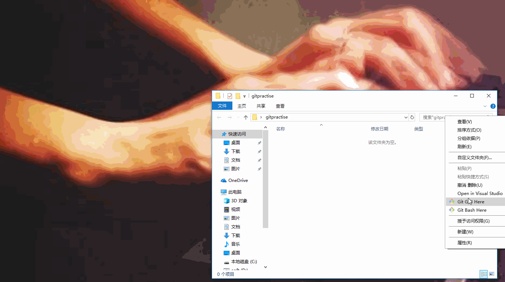
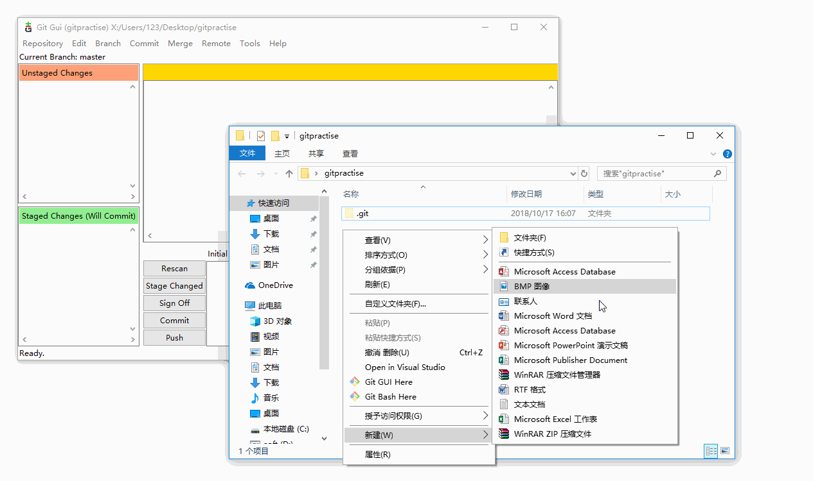

> **写在前面的话**：  
这并不是一篇讲解Git原理和命令的文章，本文旨在分享通过鼠标点击GUI界面使用Git实现日常开发的版本管理。尽管仅使用少量的Git命令就能够满足日常版本管理，一上手就展示命令行还让不少想了解Git的人望而却步，看完这篇文章，你能够使用Git GUI进行日常开发的版本管理，对Git的工作流程有基本的了解。

### 准备：
> * [git 2.19.1](https://git-scm.com/download/win)
> * 远程仓库地址: https://github.com/FrankFrankWei/git-basic-tutorial
> * 完成git配置

# 一、Git GUI基本操作
##1、版本库初始化

`gitpractise`文件夹就变成了Git可以管理的仓库，目录下多了一个`.git`文件夹，此目录是Git用于管理版本库的，不要擅自改动里面的文件，这样会破坏Git仓库。(`.git`文件夹默认是隐藏的，如果你没有看到它，不要慌。）

> 在想要初始化的文件夹的空白处右键，选择**Git GUI Here**，新建版本库时文件夹会自动定位到当前文件夹。

##2、GUI说明

工作区：列出有改动的文件
暂存区：存放将要提交到版本库的文件，工作区中修改完成的文件应将放入暂存区
差异区：在工作区/暂存区选择文件会显示出改动前后的具体信息
提交的说明：提交时写入改动的相关说明

**Rescan**：扫描出改动的文件，显示在工作区。GUI并不会实时更新对仓库的修改，需要点击*Rescan*按钮重新扫描。  
**Stage Changed**：将工作区中所有文件放入暂存区。  
**Sign off**：在提交的说明后面附加上当前git账号的信息。多人协作时方便看到提交的编辑者。  
**Commit**：将暂存区的文件提交到版本库。  
**Push**：推送到远程版本库。  

##2、新增文件
让我们从新增一个文件开始，在`gitpractise`中新建`hello.txt`文件，然后点击**Rescan**，可以看到`hello.txt`出现在*工作区*

> 对提交过的文件的修改是可以撤销的，通过**Commit -> Revert Changes**

##3、暂存
**Commit -> Stage To Commit**

这里的操作是将选定的单个文件放入暂存区（快捷键是ctrl+t)。多个文件可以按住*shift/ctrl*进行选定。暂存全部直接点击**Stage Changed**

###3.1、撤销暂存
提交前还想再编辑。**Commit -> Unstage From Commit**

> 也可以不撤销暂存，直接编辑，再次暂存。效果是一样的。

##4、提交

##5、版本节点和回滚
###5.1、 查看版本节点
为了演示版本的回滚，我对`hello.txt`做了修改并提交。此时我们有两个版本。
**Repository -> Visualize master's history**

###5.2、回滚，回到第一个版本

reset有三种模式：**soft | mixed | hard ** ，不同的模式对工作区、暂存区和版本库的影响不同，具体如下图：

**soft**：回退版本提交历史，暂存区和工作区不变。  
  
**mixed**：回退版本提交历史，暂存区文件与该版本一致，工作区不变。  
  
**hard**：回退版本提交历史，暂存区和工作区文件与该版本一致。  

# 二、一些延伸

##1. Git的仓库机制:

提交操作只会提交在暂存区的修改，工作区不受影响。

##2. 文件的生命周期：

新建文件的生命周期：

修改文件的生命周期：

# 三、分支与合并
在版本节点和回滚中，我可以看到，每次提交，Git都把它们串成一条时间线，这条时间线就是一个分支。截止到目前，只有一条时间线，在Git里，这个分支叫主分支，即master分支。  
在GIt中，可以以任一分支为原型再创建分支，此时新的分支与原型拥有一致的版本库，对新分支的任何改动都不会影响原型分支，新旧分支开始维护各自的版本。
最后，可以通过合并分支，将不同分支的内容结合到一起。  
分支让每个人拥有独立的工作空间，而合并能将所有人的工作成果归一，协同工作因此变得简单、高效。

##1、创建一个分支
**Branch -> Create**

新建并切换工作仓库至branch1，接下来就可以修改、暂存、提交。跟在master分支的操作是一样的。

分支的切换：
**Branch -> Checkout**

> 切换前要保持当前分支的工作区和暂存区是*干净的*(clean)，即没有未提交的修改。如果你修改了一半，这时由于各种原因，需要切换到其他分支工作，可以使用git stash命令，它会记录当前工作区和暂存区中文件的状态，把工作现场“储藏”起来，这样工作区就是干净的了。再次回到此分支，使用git stash pop命令，就能恢复现场。Git GUI不提供相关的操作，需要去Git bash执行这两个命令。

##2、合并分支
为了演示，我还以master为原型新建了分支*branch2*  
（1）、branch1中修改`hello.txt`的第一行为*hi~world.*，并新增文件`world.txt`  
（2）、branch2中修改`hello.txt`的第一行为*work hard pls.*  

我们看一下现在的分支情况：

###2.1、合并branch1到master
在合并之前，我们思考一下，由于branch1是在master版本上进行了修改，我们期望的合并结果应该是master中hello.txt第一行被修改为*hi~world.*，并新增文件`world.txt`，接下来就是验证。
首先切换到主分支master，然后点击菜单栏的 **Merge -> Local Merge**

结果符合预期。再看一下此时的分支情况：

可以看到此时 master跟branch1指向了同一个版本节点。

###2.2、合并branch2到master
接下来我们合并branch2到master。

合并失败！让我们仔细看一下错误提示：

提示框中有一句：*"Automatic merge failed"*，即自动合并失败。我们与合并branch1的提示做一下对比

我们看到了*"Fast-forward"*的提示。 由于master 是要并入的branch1分支的直接上游，master顺着走下去可以到达branch1分支，这种单线的历史分支不存在任何需要解决的分歧，合并过程称为快进（Fast forward）。

而合并了branch1之后的master不再是branch2的直接上游，此时合并branch2就会要求解决分歧（如果存在的话）。所以才有了*"Automatic merge failed: fix conflicts and then commit the result"*的提示。（自动合并失败，请解决冲突后再提交）。Git将文件中有冲突的地方都写入文件，同时显示在*差异区*，我们可以按图索骥，到指定文件中删除不想要的部分，然后暂存，再次提交。(这里的暂存是不可以通过点击Stage Changed实现的）   

branch1和branch2完成了它们的使命，可以通过**Branch -> Delete**进行删除，需要注意一点：不能删除工作中的分支。

> **差异区的查看**  
前面的"-1,2"分成三个部分：减号表示改动前的文件，"1"表示第1行，"2"表示连续2行。合在一起，就表示下面是修改前的文件从第1行开始的连续2行。同样的，"+1,6"表示变动后，成为改动后的文件从第1行开始的连续6行。

# 四、远程协作

现在，我们以一个托管在GitHub上的ASP.NET MVC项目来进行远程协作演示。

##1、 克隆远程仓库到本地

##2、忽略文件
细心的你会发现根目录下有一个名为`.gitignore`的文件。它用于定义*“忽略规则”*（ignore rules），每一次暂存/提交之前，Git会根据该文件内容忽略指定文件/文件夹。   在实际的开发过程中，总有一些情况是我们不想让Git跟踪某些文件的。Git提供三种忽略文件的方式

###2.1、创建局部`.gitignore`文件
在仓库的根目录下创建`.gitignore`文件，*“忽略规则”*仅作用于当前仓库。一般情况下，应该将`.gitignore`文件提交到版本库，这样就可以与克隆项目仓库的人共享*“忽略规则”*。

Github上维护有一个适用于多种现流行的操作系统/环境/开发语言的官方推荐`.gitignore`文件的[项目](https://github.com/github/gitignore)。还可以通过[gitignore.io](https://www.gitignore.io/)生成对应操作系统/开发语言/IDE的`.gitignore`文件。

###2.2、创建全局`.gitignore`文件
我们还可以通过全局`.gitignore`文件将*“忽略规则”*应用到本机上所有Git仓库。  
（1）、git config --global core.excludesfile ~/.gitignore_global。   
（2）、在用户根目录下创建`.gitignore`文件。

###2.3、显式排除出仓库
如果不想使用`.gitignore`文件，还可以通过往仓库根目录下`.git/info/exclude`文件添加*“忽略规则”*达到忽略本仓库指定文件/文件夹的目的。

> 1、如果一个文件已经添加到版本库，之后添加对应的忽略规则到`gitignore/exclude`文件并不会生效。这种情况下，需要通过以下命令先解除对文件的跟踪：   
> `git rm --cached FILENAME `  
>2、全局和局部的`.gitignore`文件会共同作用。

##3、pull和push
pull和push分别表示从远程仓库获取信息和推送本地更新到远程仓库两个操作。

多人协作时，大家都会往master分支上推送各自的修改，小伙伴已经向master推送了他的提交，而碰巧我们对同样的文件作了修改，并试图推送：

得到错误提示：

推送失败，因为小伙伴的最新提交和我们的推送存在冲突，解决办法也很简单，Git已经提示我们，先用*git pull*把最新的提交从master抓下来，然后，在本地合并，解决冲突，在Git GUI中的Pull操作需要两个步骤来完成：

1、获取远程仓库版本记录 **Remote -> Fetch** 

2、本地合并**Merge -> Local Merge**

解决冲突后，再推送：

> **写在最后的话**：  
如果你认真看完了整篇文章，那么Git日常的操作应该能够使用Git GUI完成了，这也是本文的初衷。Git作为当前最强大的版本管理工具（没有之一）拥有的功能比本文写到的要多得多，然而很多功能是通过命令行实现的，GUI只是封装了一部分常用的功能，方便入门和日常操作。如果你想深入了解Git，这是Git的[官方网站](http://git-scm.com)。  

------------------------------------------------------THE END----------------------------------------------------------

